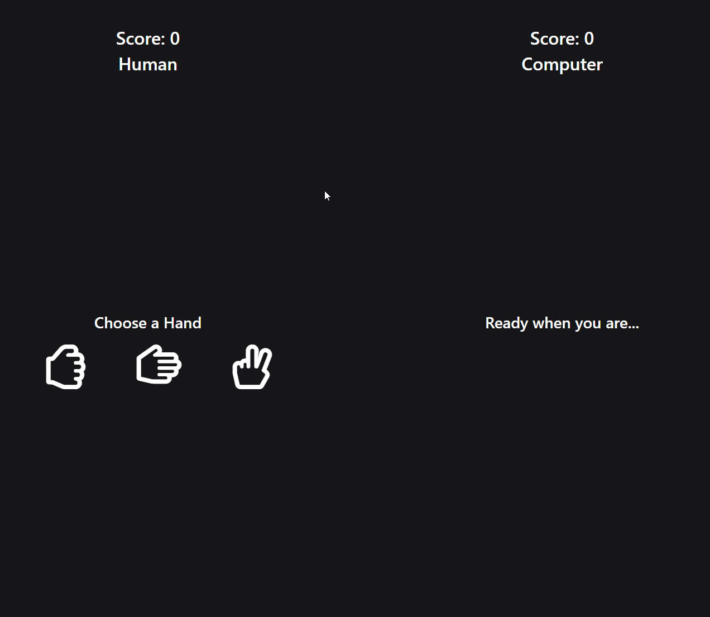

# Ching Chang Chong - A Vue.js Based Rock Paper Scissors Game :video_game:


### Live 
[Ching Chang Chong](https://ching-chang-chong.herokuapp.com/#/)

---

### :computer: Core - Technologies:
* [node: v13.2.0](https://nodejs.org/de/download/)
* [npm: 6.13.1](https://nodejs.org/de/download/)
* [vue/cli: 4.1.0](https://cli.vuejs.org/)
* [eslint/eslint-plugin-vue](https://github.com/vuejs/eslint-plugin-vue)
* [bootstrap](https://getbootstrap.com/docs/4.3/getting-started/introduction/)
* [node-sass](https://www.npmjs.com/package/node-sass)
* [express.js](https://expressjs.com/)

## :construction: Project setup
```
npm install
```

### Compiles and hot-reloads for development
```
npm run serve
```

### Compiles and minifies for production
```
npm run build
```

### Lints and fixes files
```
npm run lint
```

### Customize configuration
See [Configuration Reference](https://cli.vuejs.org/config/).
